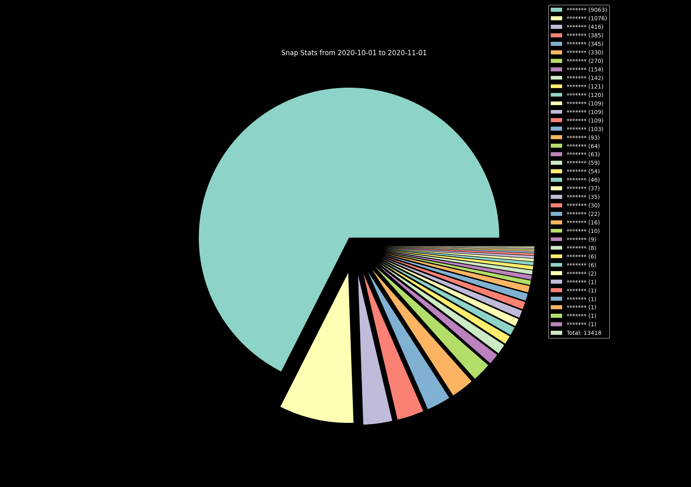

# SnapVisualizer

## Requirements

- matplotlib
  - `pip install matplotlib`


## HOW-TO

- [ ] go to [Snap Accounts Website](accounts.snapchat.com)

- [ ] click on "my data"

- [ ] request your data at bottom of page

- [ ] wait &approx; 2h for the download to be available

- [ ] download archive

- [ ] unzip

- [ ] either:

  - copy/move the following files in the same directory as`analyse.py`

    - `[archive directory]/json/snap_history.json`

    - `[archive directory]/json/chat_history.json` 
    - run `python3 analyse.py` 

  - run `python3 analyse.py --dir /path/to/json/files`

- [ ] 2 new Files (will appear in json directory): 

  - [ ] > pieExport.png

  - [ ] > snapExport.csv

## CLI Usage

```bash
$python3 analyse.py -h
usage: analyse.py [-h] [--dir PATH] [--o PATH] [--showcase]

Get pie chart from snap data :)

optional arguments:
  -h, --help  show this help message and exit
  --dir PATH  path to location of json files, defaults to script location
  --o PATH    output directory for csv and png files, defaults to json directory
  --showcase  Dont show names, mainly to generate pics for README
```


## Example

In the following example there's a `snap_history.json` file stored at `~/Downloads/snapstats`, the image is the file generated by the command shown (with names redacted)

```bash
$cd SnapVisualizer
$ls
analyse.py  README.md
$python3 analyse.py --showcase --dir ~/Downloads/snapstats --o .
[Warning] chat_history.json not found -> ignoring
$ls
analyse.py  pieExport.png  README.md  snapExport.csv
```



