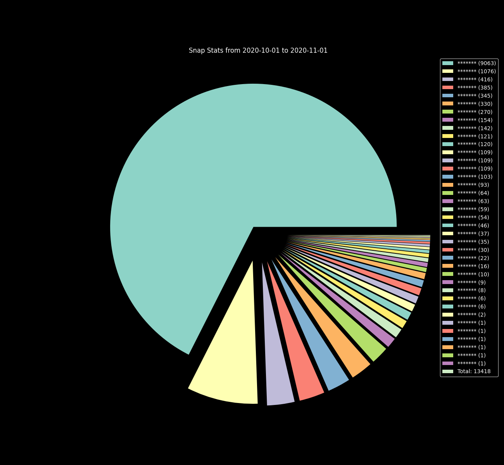

# SnapVisualizer - nested_graph

## Requirements

- matplotlib
  - `pip install matplotlib`


## HOW-TO

- [ ] go to [Snap Accounts Website](https://accounts.snapchat.com)

- [ ] click on "my data"

- [ ] request your data at bottom of page

- [ ] wait &approx; 2h for the download to be available

- [ ] download archive

- [ ] unzip

- [ ] either:

  - copy/move the following files in the same directory as`analyse.py`

    - `[archive directory]/json/snap_history.json`

    - `[archive directory]/json/chat_history.json` 
    - run `python3 analyse.py` 

  - run `python3 analyse.py --dir /path/to/json/files`

- [ ] `pieExport.png` will be created

## CLI Usage

```bash
$python3 analyse.py -h
usage: analyse.py [-h] [--dir PATH] [--o PATH] [--showcase] [--csv]

Get pie chart from snap data :)

optional arguments:
  -h, --help  show this help message and exit
  --dir PATH  path to location of json files, defaults to script location
  --o PATH    output directory for csv and png files, defaults to json directory
  --showcase  Dont show names, mainly to generate pics for README
  --csv       Generate a csv file with the computed stats
```


## Example

In the following example there's a `snap_history.json` file stored at `~/Downloads/snapstats`, the image is the file generated by the command shown (with names redacted)

```bash
$cd SnapVisualizer
$ls
analyse.py  README.md
$python3 analyse.py --showcase --dir ~/Downloads/snapstats --o .
[Warning] chat_history.json not found -> ignoring
$ls
analyse.py  pieExport.png  README.md
```





## Documentation

```python
>>>import analyse
NAME
    analyse

CLASSES
    builtins.object
        parser

    class parser(builtins.object)
     |  Methods defined here:
     |
     |  __init__(self)
     |      Initialize self.  See help(type(self)) for accurate signature.
     |
     |  __repr__(self) -> str
     |      never used, but makes sure
     |      print(parser) returns something
     |      sensible
     |
     |  count_occur(self, history: list, isReceived: bool)
     |      main method that evaluates list of snap entries passed by parse_hist()
     |      - stores number of snaps per username in self.stats
     |      - stores total amount of evaluated snaps in self.total_snaps
     |
     |  export(self, fname: str = 'snapExport')
     |      write stats to valid csv file in working directory,
     |      will be saved as "{fname}.csv"
     |
     |  get_sorted(self) -> list
     |      return list of tuples of form
     |      "(username,self.stats[username])"
     |      sorted by value (#of snaps)
     |
     |  makePie(self, fname='pieExport')
     |      Creates pie chart of data in self.stats
     |      using matplotlib, exports the image
     |      as [fname].png to the directory of the
     |      json files (SCRIPT_PATH)
     |
     |  parse_hist(self, cont: dict)
     |      take some parsed xxxx_history.json files content as
     |      dict and count through the snaps in it
     |
     |  update_date_range(self, newDate: str)
     |      called with a datetime string, if necessary updates
     |      earliest/latest seen calendar date
     |
     |  ----------------------------------------------------------------------
     |  Data descriptors defined here:
     |
     |  __dict__
     |      dictionary for instance variables (if defined)
     |
     |  __weakref__
     |      list of weak references to the object (if defined)

FUNCTIONS
    compare_date(a: str, b: str) -> bool
        Takes two datetime Strings a and b in the form
        "yyyy-mm-dd hh:mm:ss UTC"
        and returns whether a is on an earlier calendar
        day than b

    main()
        main method, gets executed when
        script is called from command line
```

